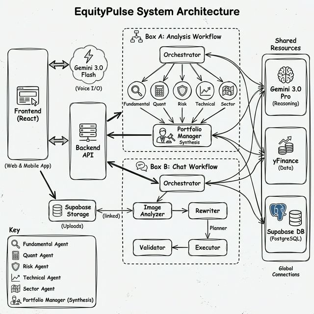
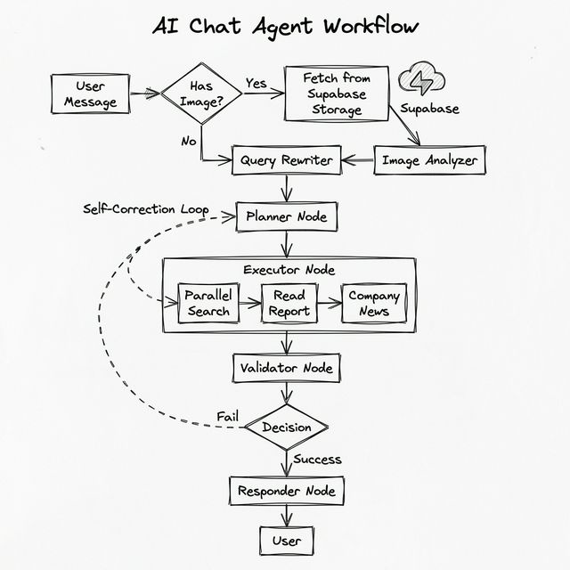

# EquityPulse: The AI Investment Committee 🧠 📈

**"The Hedge Fund in Your Pocket"**

> **Winner of the [Hackathon Name] Hackathon (Target)**
>
> *Global Investing Crisis:*
> * **India**: 91% of retail traders lose money (SEBI).
> * **USA**: 72% failure rate for day traders (FINRA).
> * **Europe**: 76-89% of retail CFD accounts lose money (ESMA/FCA).
> * *EquityPulse exists to fix this information asymmetry.*


### System Architecture


## 💡 The Problem: Information Asymmetry
Wall Street has teams of 50+ analysts working 100-hour weeks. They read every footnote, track every supply chain, and model every risk.
**You have a day job and a Reddit tip.**

Most "AI for Finance" tools are just simple RAG wrappers. They search for 3-4 snippets of text and summarize them. They lack **depth, context, and reasoning**.

## 🚀 The Solution: Autonomous Multi-Agent Reasoning
EquityPulse is not a chatbot. It is an **Autonomous Investment Committee**. It orchestrates a team of 5 specialized AI agents, each mimicking a specific role in a hedge fund, to debate and analyze a stock from every angle.

### "Full-Spectrum Reasoning" (Powered by Gemini 3.0 Pro & 3.0 Flash)
*   **Backend Reasoning**: We feed the **ENTIRE Annual Report (10-K)** directly into **Gemini 3.0 Pro** for deep analysis.
*   **Frontend Voice**: We use **Gemini 3.0 Flash** for sub-100ms latency voice interactions, creating a real-time conversation loop.

### 🌟 Key Features
*   **Universal Multimodal Analysis**: Upload screenshots of news, partnership announcements, or charts. The agent analysis matches the pixel data with the financials.
*   **Text-to-Speech & Voice Control**: Use the integrated Voice features to have natural, spoken conversations with your AI Investment Committee.
*   **Deep Financial & Forensic Analysis**: Analyzes **50+ Financial Parameters** and **Hundreds of Qualitative Signals** (Geopolitics, Management Integrity, Macro Trends). See [PARAMETERS.md](PARAMETERS.md).
*   **Smart Annotations**: Highlight any text in the report to instantly ask the agent about that specific paragraph.

## 🕵️ The Agents (The "Swarm")

1.  **Fundamental Analyst (The "Buffett")** 🏰
    *   *Focus*: Moats, Intrinsic Value, ROIC, Free Cash Flow Yield.
    *   *Goal*: Find "Wonderful Companies at Fair Prices".
2.  **Quant Analyst (The "Jim Simons")** 🔢
    *   *Focus*: Insider Cluster Buying, Institutional Ownership, Beneish M-Score (Fraud Detection), Altman Z-Score (Bankruptcy Risk).
    *   *Goal*: Trust the math, not the narrative.
3.  **Risk Manager (The "Bear")** 🐻
    *   *Focus*: Downside protection, Geopolitical exposure, Supply chain fragility, Litigation risk.
    *   *Goal*: "Kill the trade".
4.  **Sector Strategist (The "Macro")** 🌍
    *   *Focus*: Interest rate sensitivity, Sector rotation, Business cycle stage.
    *   *Goal*: Don't fight the tide.
5.  **Technical Analyst (The "Trader")** 📊
    *   *Focus*: RSI Divergences, Volume Profile, Stage Analysis.
    *   *Goal*: Time the entry.
6.  **Portfolio Manager (The "CIO")** 🗣️
    *   *Focus*: Synthesis, Conflict Resolution, Risk-Adjusted Returns.
    *   *Goal*: The final decision maker. It aggregates all agent reports, weighs conflicting evidence, and produces the final investment thesis.

## 💬 The "Analyst" Chat Architecture
Beyond static report generation, EquityPulse features a stateful, multi-agent chat system designed to answer follow-up questions with the depth of a human analyst.

*   **Image Analyzer (Vision)**: If an image is uploaded (chart, news snippet), this node extracts key insights and passes them as context to the rewriter, enabling "visual reasoning".
*   **Query Rewriter**: Decomposes complex user questions into specific sub-queries (e.g., "Impact of Rate Cuts" → "Sector Rotation history", "Cost of Capital changes").
*   **Planner Node**: Dynamically creates an execution plan. It decides whether to answer directly, consult the annual report, or launch a **Parallel Web Search** for real-time market trends.
*   **Parallel Search Executor**: Runs loose-coupled, concurrent searches to gather diverse viewpoints (Competitor news, Regulatory filings, Macro data) in seconds.
*   **Validator Node**: A self-reflection loop. If the gathered data is insufficient, it rejects the output and triggers a **Replanning Phase** to try a different strategy.
*   **Responder Node**: Synthesizes the final answer, citing specific page numbers from the report and linking to external sources.

### Chat Workflow


## ⚔️ The "Conflict" Engine
Most AIs agree with themselves. **Ours argue.**
The *Portfolio Manager* node takes the conflicting reports (e.g., "Quant says SELL, Fundamental says BUY") and synthesizes a nuanced final verdict, just like a real investment committee meeting.

## 🛠️ Tech Stack
-   **AI Core**: Google Gemini 3.0 Pro (Long Context Reasoning).
-   **Orchestration**: LangGraph (Stateful Multi-Agent Workflow).
-   **Backend**: Python, FastAPI, Async SQLModel.
-   **Frontend**: React 19, Tailwind CSS (Premium "Dark Data" UI).
-   **Data**: yFinance, DuckDuckGo Search (Real-time).

## ⚡ Getting Started

### Prerequisites
*   Python 3.11+
*   Node.js 18+
*   Google Gemini API Key

### Backend Setup
```bash
cd backend
python3 -m venv .venv
source .venv/bin/activate
pip install uv && uv sync
cp .env.example .env  # Add your GOOGLE_API_KEY
uvicorn app.main:app --reload
```

### Frontend Setup
```bash
cd frontend
npm install
npm run dev
```

## 📜 License
MIT License.
