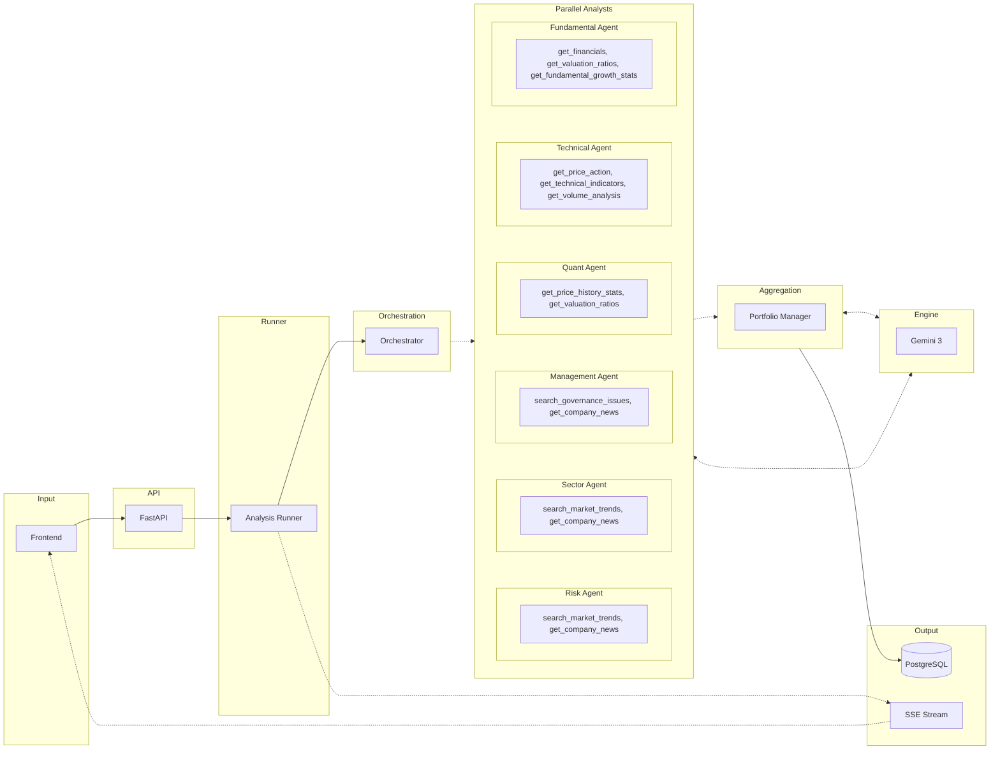

# EquityPulse Backend Architecture

```mermaid
flowchart LR
    subgraph Input
        FE["Frontend"]
    end

    subgraph API
        FAST["FastAPI"]
    end

    subgraph Runner
        AR["Analysis Runner"]
    end

    subgraph Orchestration
        ORCH["Orchestrator"]
    end

    subgraph Analysts["Parallel Analysts"]
        subgraph F[" Fundamental Agent "]
            F_T["get_financials, get_valuation_ratios, get_fundamental_growth_stats"]
        end
        subgraph T[" Technical Agent "]
            T_T["get_price_action, get_technical_indicators, get_volume_analysis"]
        end
        subgraph Q[" Quant Agent "]
            Q_T["get_price_history_stats, get_valuation_ratios"]
        end
        subgraph M[" Management Agent "]
            M_T["search_governance_issues, get_company_news"]
        end
        subgraph S[" Sector Agent "]
            S_T["search_market_trends, get_company_news"]
        end
        subgraph R[" Risk Agent "]
            R_T["search_market_trends, get_company_news"]
        end
        F ~~~ T ~~~ Q ~~~ M ~~~ S ~~~ R
    end

    subgraph Aggregation
        AGG["Portfolio Manager"]
    end

    subgraph Engine
        GEM["Gemini 3"]
    end

    subgraph Output
        DB[("PostgreSQL")]
        SSE["SSE Stream"]
    end

    FE --> FAST --> AR --> ORCH
    Orchestration -.-> Analysts
    Analysts -.-> Aggregation
    Analysts <-.-> Engine
    Aggregation <-.-> Engine
    Aggregation --> DB
    AR -.-> SSE -.-> FE
```
